# HExIt2025: Thinking Fast and Slow - Enhanced Game Playing Agent

HexIt is a Hex board game AI agent based on the Expert Iteration (ExIt) algorithm, implemented in pure Python.

## Background

This project uses the Expert Iteration algorithm -- presented by Anthony, et al and similar to DeepMind's [Alpha Go Zero](https://deepmind.com/blog/alphago-zero-learning-scratch/) -- to train an agent tabula rasa to play the board game Hex.  Expert Iteration uses two learners, and "expert" (typically a tree search algorithm) and an "apprentice" (typically a neural network) that iteratively improve each other.

In this implementation (as in Anthony, et al.) the expert is implemented from scratch using Monte Carlo Tree Search (MCTS), and the apprentice is implemented using a policy network (given a state, predicts a distribution over all the legal actions).  The network uses convolutional and fully connected layers, with ReLu activations and batch normalization.

- Inspired by the [Thinking Fast and Slow With Deep Learning and Tree Search](https://papers.nips.cc/paper/7120-thinking-fast-and-slow-with-deep-learning-and-tree-search)  paper from Anthony, Tian and Barber,  (NIPS 2017).
- Previously, it was a Python and C++ hybrid implementation at [aravinho/hexit](https://github.com/aravinho/hexit).

At each timestep, the algorithm works as follows:

* The apprentice runs several episodes of self-play, and samples on state at random from each of the episodes.
* **Expert Improvement Step**: From each state *s*, the expert runs several *N*-MCTS simulations.  *N*-MCTS (Neural-MCTS) is a modification of traditional MCTS that is bootstrapped with the apprentice (expert improvement), which helps choosing actions (see Appendix).  At the end of all the simulations from state *s*, *N*-MCTS will have produced an "expert" distribution over the actions available from *s*.
* **Imitation Learning Step**: The apprentice is trained to predict action distributions that mimic those produced by the expert.  Given a state *s*, the network seeks to minimize the cross-entropy between its predicted distribution and that of the expert.

This process repeats.  The newly improved apprentice generates more realistic game states through self-play.  The expert, aided by the improved apprentice, produces better expert distributions for each of these states.  The apprentice improves by learning to mimic these new expert policies.

Note: This strategy is pretty much different from AlphaZero, which uses a Policy Network to guide the MCTS selection and a Value Network to guide the MCTS rollout. While in [Thinking Fast and Slow With Deep Learning and Tree Search](https://papers.nips.cc/paper/7120-thinking-fast-and-slow-with-deep-learning-and-tree-search)  paper, fast system I and slow system II are relatively independent of each other.

## The Game Hex

A [Hex](https://en.wikipedia.org/wiki/Hex_(board_game)) board is made up of hexagonal spaces arranged on an *n* by *n* rhombus-shaped board.  Players take turns placing stones on the board.  Player 1 (Red) wins if his pieces form a connected path from the north row of the board to the south row.  Player 2 (Blue) wins if her pieces form a connected path from the west column to the east.  In this image of an 11 x 11 board, Player 2 has won.

<p align="center">
	
</p>

Hex is easily representable using an MDP; there are clear notions of states (a board configuration), actions (where to play the next stone), and rewards (a game of Hex always ends with a winner and a loser).  It is proven that there is an optimal strategy for Player 1, which adds a layer of interest to the problem of creating a Hex-playing agent.

## Tools Used

* The implementation of the MDP environment and the implemention of the *N-*MCTS expert are now both built from Python
* The apprentice neural network is built with Tensorflow 1.0, and trained using Python.
* Inference of the apprentice network is done using Tensorflow
* Bazel is used as the build system.

## Optimizations (2025)

### Core Architecture Improvements

- **Unified Module System**: Implemented `module_locator.py` for unified module imports, resolving circular reference issues
- **Functional Programming Paradigm**: Refactored core modules using functional and flat design principles
- **Testable Architecture**: Added independent test suites to ensure component reliability

### Neural Network Enhancements

- **Value Head Prediction**: Added a value head network branch to predict win probabilities and guide decision-making
- **Real MCTS Distributions**: Used actual visit counts instead of one-hot encoding, providing richer policy information
- **Input Standardization**: Standardized to 164-dimensional vector inputs (2 channels of 9×9 padded board + 2 turn mask values)
- **Distribution Analysis**: Added entropy calculations and distribution visualization to optimize training monitoring

### Performance and Usability Improvements

- **Training Pipeline Optimization**: Implemented more efficient batch processing and data pipelines
- **Model Checkpoints**: Automatic saving of training snapshots for quick recovery
- **Interactive Analysis**: Added runtime distribution analysis functionality
- **Documentation and Comments**: Comprehensive code documentation updates to improve maintainability

## Policy Visualizations

### Policy Distribution Samples

<p align="center">
  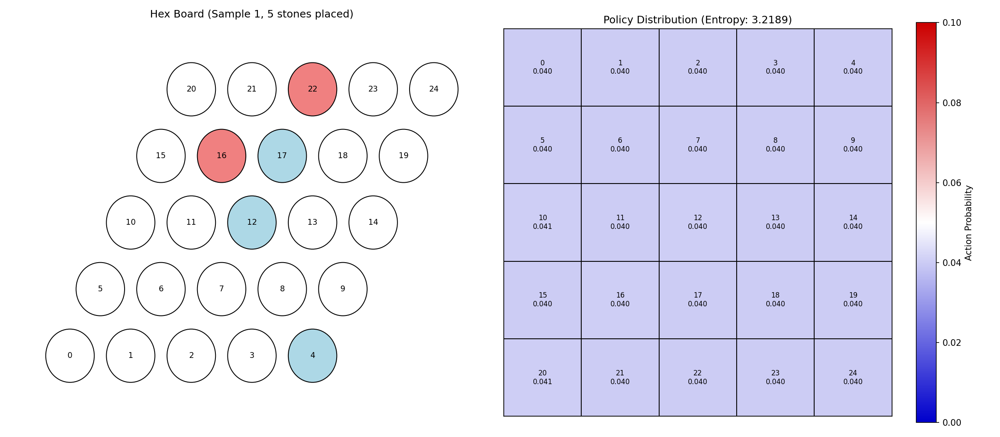
  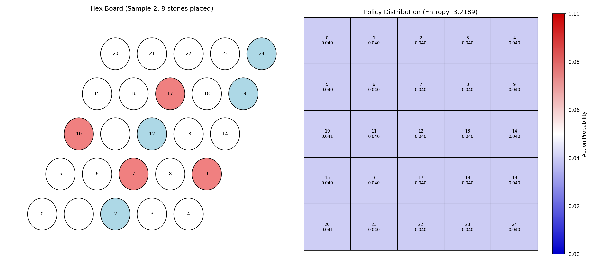
  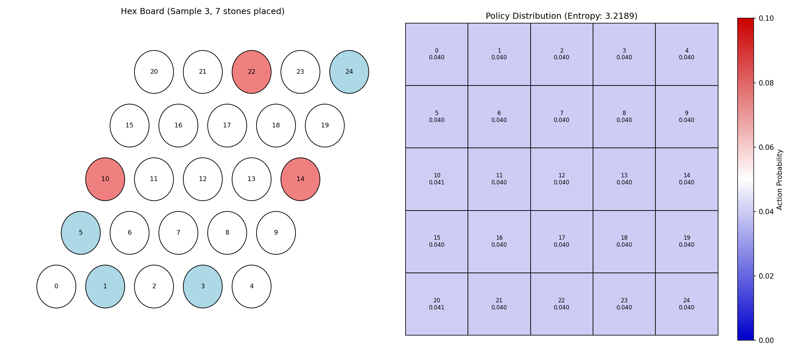
  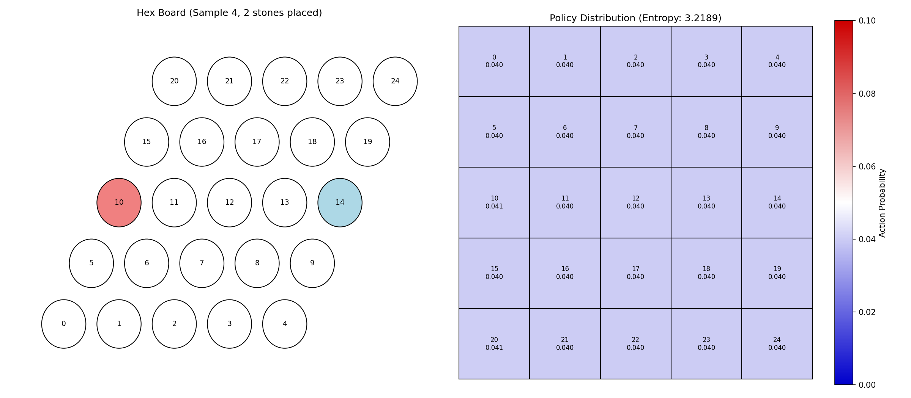
  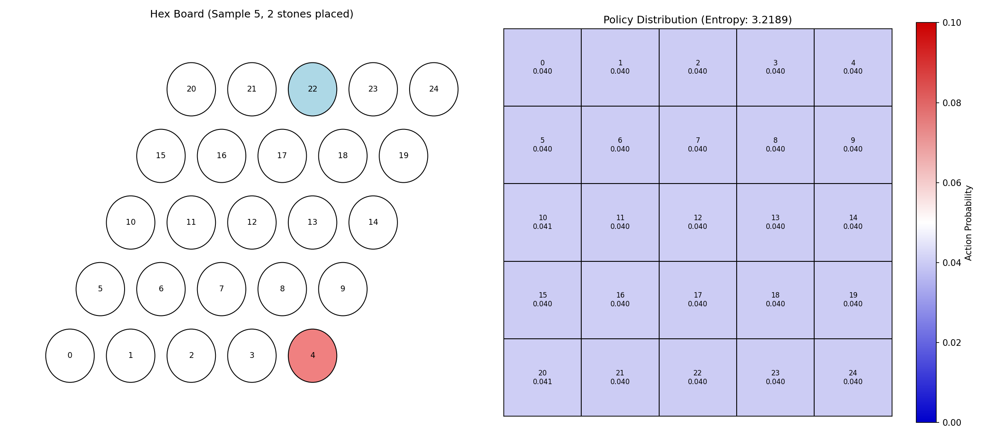
  <br>
  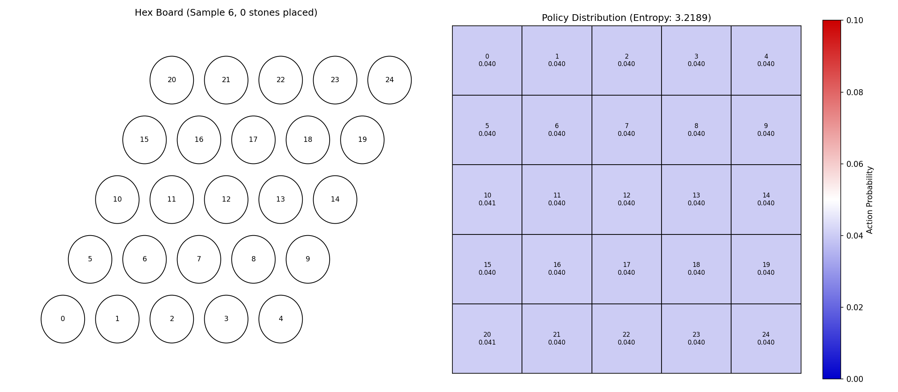
  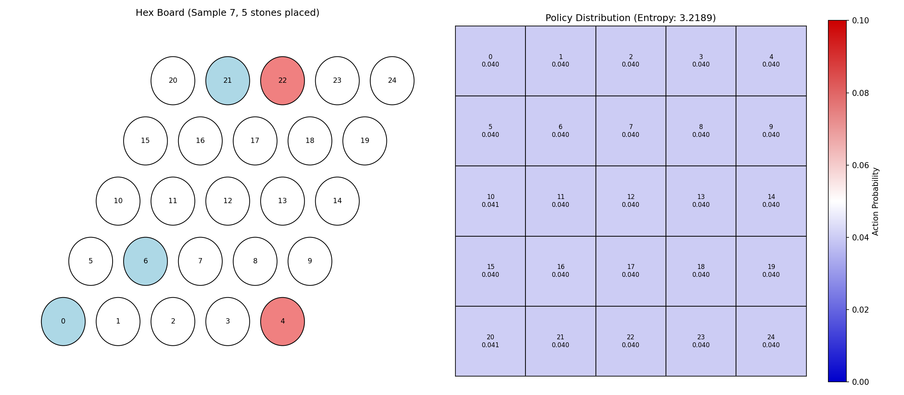
  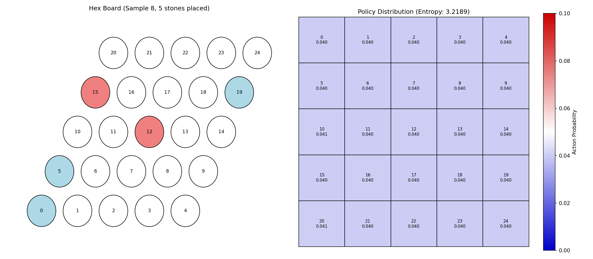
  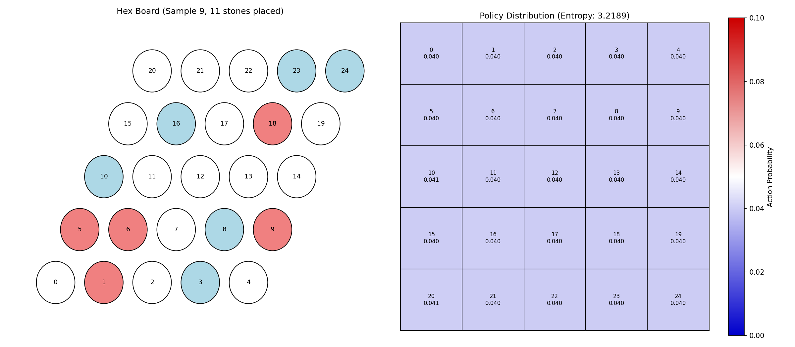
  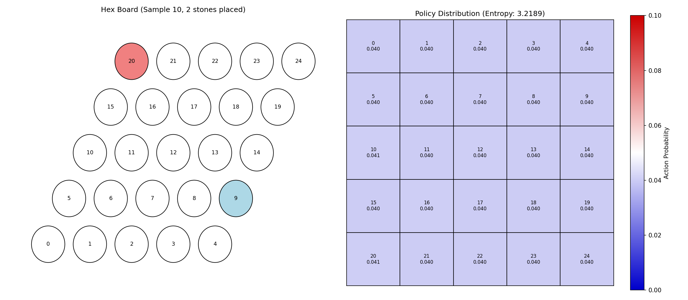
  <br>
  <em>Policy distribution heatmaps showing MCTS visit counts across different game states</em>
</p>

### Policy Statistics

<p align="center">
  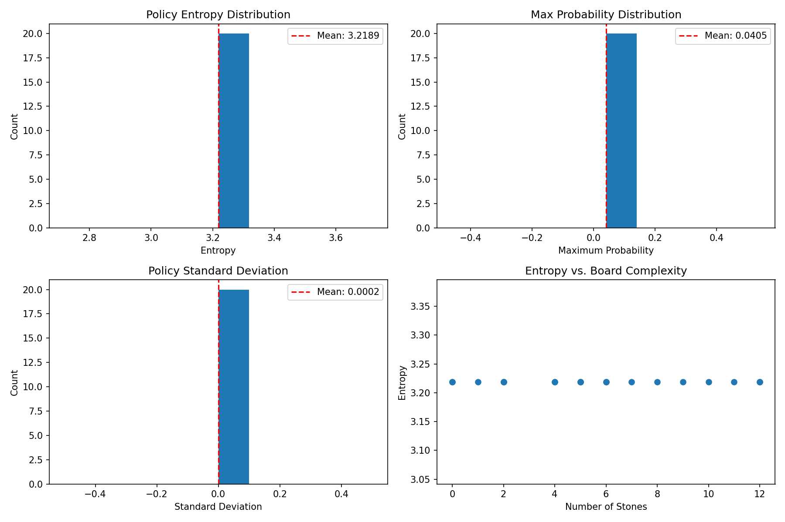
  <br>
  <em>Comprehensive statistics analyzing policy distributions across game progression</em>
</p>

## Project Structure and Module Functionality

This project follows modular, functional, and flat design principles with clear code organization and well-defined dependencies. The main files and their functions are as follows:

### Core Modules

```
/hexit
├── src/                       # Source code directory
│   ├── __init__.py           # Unified entry point, resolves circular references
│   ├── module_locator.py      # Module locator system, manages dependencies
│   ├── config.py             # Global configuration variables
│   ├── hex.py                # Hex board game logic implementation
│   ├── hex_nn.py             # Hex neural network model definition
│   ├── agents.py             # Agent implementations (NN, MCTS, etc.)
│   ├── mcts.py               # Monte Carlo Tree Search implementation
│   ├── value_prediction.py    # Value head prediction module (new)
│   ├── mcts_distributions.py  # MCTS distribution processing module (new)
│   └── optimizations_test.py  # Optimization features test module (new)
├── improved_expert_iteration.py  # Enhanced expert iteration main loop
├── run_improved_training.py     # Simplified training startup script
├── requirements.txt           # Project dependencies
└── README.md                  # Project documentation
```

### Module Relationships

1. **Foundation Layer**

   - `module_locator.py` is the foundation for all module imports, resolving circular reference issues
   - `__init__.py` sets up Python paths and registers core modules
   - `config.py` stores global variables and configuration options
2. **Core Components**

   - `hex.py` defines the `HexState` class, implementing game logic
   - `hex_nn.py` implements the `HexNN` class, containing policy head and the new value head
   - `agents.py` implements various agents, including `NNAgent` and `MCTSAgent`
   - `mcts.py` implements the MCTS algorithm and `MCTS_Node` class
3. **Optimization Modules**

   - `value_prediction.py` provides purely functional value prediction processing
   - `mcts_distributions.py` handles MCTS visit distributions and temperature application
   - `optimizations_test.py` contains complete test suites
4. **Training Loop**

   - `improved_expert_iteration.py` implements the enhanced expert iteration main process
   - `run_improved_training.py` provides a simplified startup entry point

## Environment Setup and Running Guide

### Requirements

The project is developed with Python 3.6+ and depends on the following libraries:

```shell
# Install dependencies
pip install -r requirements.txt
```

### Running Training

Multiple running options are provided, from simple to complex:

1. **Quick Start: Using Simplified Launch Script**

```shell
# Run improved expert iteration training with default parameters
python run_improved_training.py
```

2. **Run Tests: Validate Optimization Features**

```shell
# Test all optimization features
python src/optimizations_test.py

# Test only value head functionality
python src/optimizations_test.py --value-only

# Test only MCTS distribution functionality
python src/optimizations_test.py --mcts-only
```

3. **Custom Training: Directly Call Main Training Loop**

```shell
# Directly run the expert iteration main loop
python improved_expert_iteration.py
```

### Training Parameters Adjustment

Main training parameters are defined at the beginning of `improved_expert_iteration.py`:

```python
# ========== Parameter Section ==========
BOARD_SIZE = 5               # Board size
NUM_EXPERT_ITER = 3          # Number of Expert Iteration rounds
NUM_SELFPLAY_GAMES = 20      # Number of self-play games per round
NUM_EVAL_GAMES = 20          # Number of evaluation games per round
TRAIN_EPOCHS = 5             # Number of neural network training epochs
BATCH_SIZE = 32              # Batch size
LEARNING_RATE = 0.001        # Learning rate

CB_VALUES = [1.0]            # Exploration constant parameter list
TEMPERATURE_VALUES = [0.2]   # Temperature parameter list
NUM_SIMULATIONS_LIST = [500] # MCTS simulation count list
```

To enhance learning efficiency, you can adjust these parameters based on hardware limitations:

1. For smaller systems, consider reducing `NUM_SELFPLAY_GAMES` and `NUM_SIMULATIONS_LIST`
2. For quick prototype testing, set `NUM_EXPERT_ITER=1` and `TRAIN_EPOCHS=3`
3. For deep training, it's recommended to use `NUM_EXPERT_ITER=10` and `NUM_SELFPLAY_GAMES=100`

### Output and Logs

The training process generates the following outputs:

1. **Terminal Output**: Contains training progress, loss values, and win rates
2. **Model Files**: Saved in the `models/hex/{board_size}/improved/` directory
3. **Log File**: `improved_expert_iteration_log.json` contains complete training records

## New Features Usage Guide

### Value Head Prediction

The value head prediction functionality is integrated into the improved training loop and can be called as follows:

```python
# Set the value weight through the HexNN class before starting training
from src.hex_nn import HexNN
HexNN.VALUE_WEIGHT = 0.5  # Adjust value head weight (0.0-1.0)

# Or use the value prediction module to directly create labels
from src.value_prediction import create_value_labels
value_labels = create_value_labels(winners, current_players)
```

### MCTS Distribution Functionality

The MCTS distribution functionality can be called from multiple levels:

```python
# High-level: Use directly in MCTSAgent
action, distribution = mcts_agent.getAction(state, sess, return_distribution=True)

# Mid-level: Use the MCTS distribution module
from src.mcts_distributions import apply_temperature, analyze_distribution
dist = apply_temperature(distribution, temperature=0.5)  # Apply temperature parameter
metrics = analyze_distribution(dist)  # Analyze distribution characteristics
```

*See the Policy Visualizations section for examples of policy distributions and the effects of temperature parameter.*

## Results and Performance

Our 5x5 Hex agent has reached optimal performance. When playing as the first player (Player 1), it consistently wins. It not only defeats random opponents but also beats human players and powerful MCTS agents. This is because it has essentially learned the optimal first-player strategy for a 5x5 board. The agent was trained on approximately 1 million data points generated during three rounds of expert iteration. The total training time was about two days.

## Appendix

### N-MCTS (Neural Monte Carlo Tree Search)

N-MCTS is a modification of the traditional [MCTS](https://en.wikipedia.org/wiki/Monte_Carlo_tree_search) algorithm that uses the neural network apprentice to aid in making decisions.  Given a state *s* , N-MCTS builds up a search tree by running several simulations (I use 2000), each of which starts at *s*.  Every node in the tree corresponds to some state (a Hex board configuration), and edges correspond to actions.  Every node keeps statistics on how many times it was visited, how many times it took each action *a*, and for each action, tracks the total reward obtained from simulations in which this node took action *a*.

Each simulation starts at the "root" node of the tree, the node corresponding to state *s*.  The simulation can be broken into three phases, **selection**, **rollout** and **backpropagation**.

* **Selection Phase**: We start at the root node, which corresponds to state *s*, and need to decide which action to take.  We compute "scores" for each of the actions.  The score *U(s, a)* for action *a* is a function of *n(s)*, the number of visits to node *s*, *n(s, a)*, the number of times we've taken action *a* from state *s*, and *r(s, a)*, the total reward over all simulations in which we took action *a* from state *s*.  The formula (shown below) also contains a term that weights the prediction of the apprentice (which is why it's called *Neural*-MCTS).  We act greedily and take the action that maximizes *U(s,a)* to reach a new node *s'*.  We repeat this process until some pre-determined tree depth, or until we reach a terminal state.

$$
U(s, a) = \frac{r(s,a)}{n(s,a)}   +   \beta \sqrt{\frac{log n(s)}{n(s,a)}}   +    \gamma \text{apprentice}(s, a).
$$

where $\beta$ and $\gamma$ are hyperparameters (0.05 and 40 respectively).

* **Expansion Phase**
* **Rollout (Simulation) Phase**: Once we've hit the max depth for the selection phase, we perform "rollout", and randomly take actions until we reach a terminal state.
* **Backpropagation** (Do not confuse with Gradient Descent Backpropagation): Once we've reached a terminal state, observe the reward; call it *R*.  Propagate back up the tree, along the path for this simulation, and update the statistics for every node.  At every node *v* along this path, increment *n(v)* and *n(v, a*)*, where *a* * is the action we took from state *v* in this simulation.  Add *R* to *r(v, a)*.  Once all the statistics have been updated, start the next simulation from the root node.

After all the simulations are finished, we calculate the number of times each action was chosen from the root.  This is what we defined as our "expert" distribution for state *s*.

The motivation behind MCTS is that, while initially, actions may be chosen at random, over the course of many simulations, nodes will learn which actions have been fruitful, and which should be avoided.  The motivation behind **N**-MCTS is that the prediction of the neural network can guide the expert in useful directions during the early simulations, in which nodes have sparse statistics.

**Note**: The Anthony, et al. paper calls the action scores *UCT-NN(s, a)* since they are derived from * **U**pper **C**onfidence Bounds for **T**rees, and are bootstrapped with a **Neural** **Network**.*

**Note**: Several optimizations can be made to this basic template.  Some that work well include:

* Sampling actions proportional to their *U*-scores, rather than acting greedily.
* Running multiple rollouts in parallel, and averaging the eventual reward for a lower variance estimate of reward.
* Defining a maximum depth after which rollout must begin, in order to avoid taking the same path every simulation.
* Anthony, et al. propose a variant of the *UCT-NN* formula, with an added term called the Rapid Action Value Estimation (RAVE) term.  This uses an all-moves-as-first heuristic to estimate the value of an action during early simulations in which statistics are scarce.  See Anthony, et al. paper for details.
